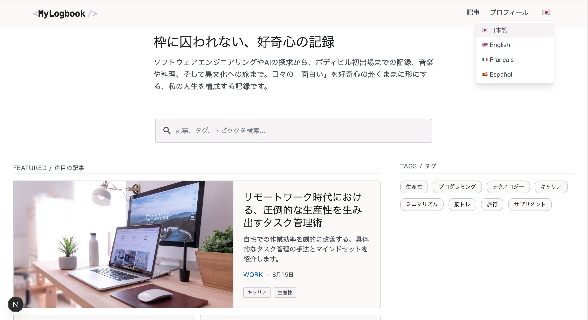
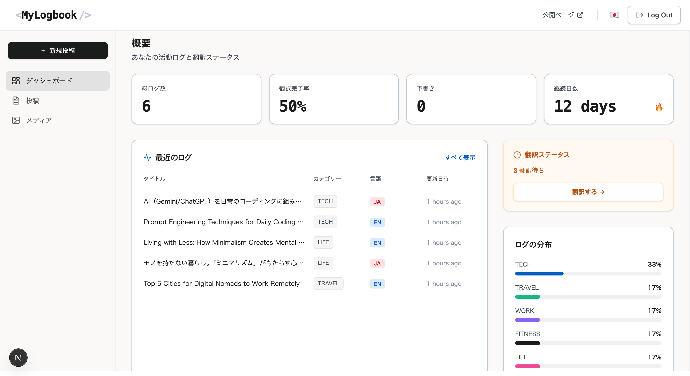
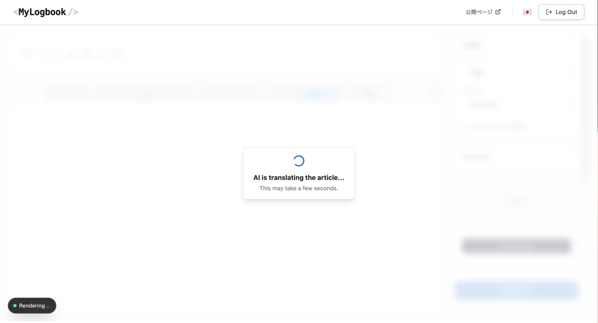
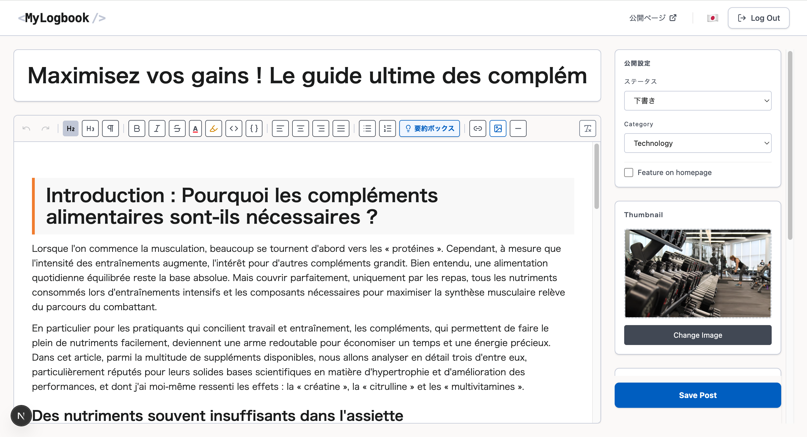
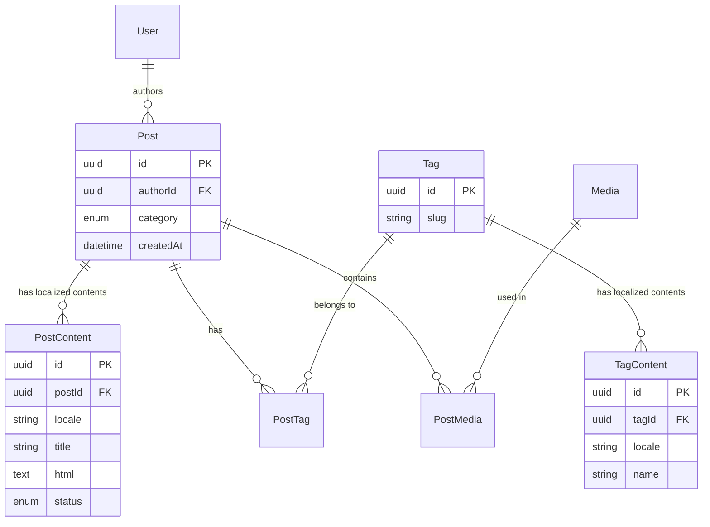

<div align="right">
 <a href="#english">🇺🇸 English</a> |  <a href="#japanese">🇯🇵 日本語</a>
</div>

<a id="english"></a>

# MyLogbook 🌍

> A full-stack blog system broadcasting my daily interests to the world in multiple languages—from software engineering to bodybuilding and cross-cultural experiences.

[](https://nextjs.org/)
[](https://www.typescriptlang.org/)
[](https://www.prisma.io/)
[](https://supabase.com/)

<table width="100%">
  <tr>
    <td width="50%">
      <b>🏠 Home (Public)</b><br>
      
    </td>
    <td width="50%">
      <b>📝 Post Detail (Public)</b><br>
      
    </td>
  </tr>
</table>

<!-- Admin Pages (Accordion View) -->
<details>
  <summary><b>🛠 View Admin Pages (Dashboard & AI Translation Flow)</b></summary>
  <br>
  <table width="100%">
    <!-- Row 1: Dashboard -->
    <tr>
      <td colspan="2">
        <b>📊 Admin Dashboard</b><br>
        
      </td>
    </tr>
    <!-- Row 2: AI Translation Process (Loading -> Complete) -->
    <tr>
      <td width="50%">
        <b>⏳ AI Translation (Processing)</b><br>
        
        <br><i>* Thoughtful loading UI during external API communication</i>
      </td>
      <td width="50%">
        <b>✨ Translated Result (French)</b><br>
        
        <br><i>* Automated translation to French (etc.) while perfectly preserving Tiptap's HTML structure</i>
      </td>
    </tr>
  </table>
</details>

🔗 **Live Website:** [https://.com](https://.com)

<br>

## 📝 Project Purpose & Overview

This project was developed not just as a personal blog, but as a playground for **"exploring modern web technologies"** and **"automating multilingual content delivery using AI."**
Articles written in Japanese are automatically translated into multiple languages using the Gemini AI, providing seamless multilingual routing powered by `next-intl`.

<br>

## ✨ Features

**For Public Users**

- 🔍 **High-Speed Search & Filtering**:
  - **Keyword Search**: Fetches article data for the current locale and filters titles/descriptions in-memory on the Next.js side. By not relying on external search engines, it delivers the simplest and fastest UX for small-to-medium scale blogs.
  - **Tag Search**: Accurately fetches only the articles associated with selected tags by traversing database relationships.
- 🌐 **Seamless Localization**: A locale switcher in the header enables instant language switching via `next-intl` routing.

**For Administrators**

- ✍️ **Rich Text Editor**: Intuitive article authoring utilizing Tiptap.
- 🤖 **AI Auto-Translation**: Generates translated articles and tags (e.g., to English) from Japanese source text with a single click using Gemini AI.
- 🎛️ **Admin Dashboard**: Comprehensive management of post statuses (publish/draft) and metadata.

<br>

## 🛠 Tech Stack & Reasoning

| Category         | Technology                     | Reason for Selection                                                                                                                                                            |
| ---------------- | ------------------------------ | ------------------------------------------------------------------------------------------------------------------------------------------------------------------------------- |
| **Frontend**     | Next.js (App Router), React 19 | Essential for blog SEO and achieving fast initial rendering via SSR/SSG.                                                                                                        |
| **Backend/BaaS** | Supabase (PostgreSQL)          | Chose a relational database to handle complex multilingual data models (normalization). It offers a robust free tier and seamless integration with Auth/Storage.                |
| **ORM**          | Prisma                         | Strong type safety with TypeScript allows for secure and efficient querying of nested multilingual content.                                                                     |
| **Styling**      | Tailwind CSS (v4)              | For rapid, utility-first UI development. The `@tailwindcss/typography` plugin allows applying beautiful, consistent styles to editor-generated HTML via a single `prose` class. |
| **Editor**       | Tiptap                         | A headless editor with fantastic React affinity. It saves clean HTML data, allowing complete separation from presentation-side styling (Tailwind).                              |
| **AI**           | Gemini API                     | Highly cost-effective (or free) operation and excellent structured output capabilities (JSON Schema) make it optimal for stable translation automation.                         |
| **i18n**         | next-intl                      | High compatibility with the Next.js App Router, simplifying multilingual routing and translation management within Server Components.                                           |

<br>

## 📂 Architecture

To enhance maintainability and scalability, the directory structure is designed with **Separation of Concerns** in mind. Business logic and AI prompts are deliberately decoupled from UI components, resulting in a highly testable and modifiable architecture.

```text
.
├── actions/       # Server Actions (Entry points for server-side processing called from the frontend)
├── app/           # Next.js App Router (i18n enabled)
│   └── [locale]/  # Locale-based routing (en, ja, etc.)
│       ├── (public)/ # Public-facing pages
│       └── admin/    # Admin dashboard pages
├── components/    # Presentation layer (Domain-driven: admin, public, ui, common)
├── i18n/          # next-intl configuration and routing
├── messages/      # JSON translation files for each language
├── prisma/        # Schema definitions and migration history
├── prompts/       # Prompt management for Gemini AI
├── schemas/       # Validation schemas using Zod
└── services/      # Core business logic (DB operations, external API calls, etc.)
```

<br>

## 🏗 Database Design (ER Diagram)

Data modeling was the biggest focus in supporting multiple languages.
I adopted the **Entity-Translation Pattern**, strictly separating article metadata (`Post`) from language-specific content (`PostContent`). This highly scalable design allows for adding infinite new languages in the future without altering the core schema.



<br>

## 🤖 AI-Driven Workflow

In this project, AI isn't just integrated into the product itself (Gemini translations)—it is deeply embedded into the **development cycle** to maximize productivity.

- **UI/UX Brainstorming**: Leveraged Figma's AI features to brainstorm wireframes and UI components, quickly finalizing a polished design despite being a solo developer.
- **Design-to-Code via MCP**: Utilized an **MCP (Model Context Protocol)** server to bridge Figma and GitHub Copilot. By feeding the design context (Figma data) directly to the AI assistant, the implementation of Tailwind CSS and React components was semi-automated, drastically reducing frontend development lead time.

By avoiding "reinventing the wheel" and delegating boilerplate coding to AI, I was able to concentrate my time on core engineering challenges, such as **"multilingual database modeling"** and **"designing robust AI translation prompts."**

<br>

## 🧗 Challenges & Solutions

### 1. Stabilizing LLM HTML Translation & Tiptap Edge Cases

When translating blog articles (HTML strings) via the Gemini API, the AI frequently hallucinated by reacting to empty trailing `<p>` tags generated by the Tiptap editor, causing it to generate infinite empty tags. Additionally, storing HTML inside JSON caused frequent parsing errors due to unescaped quotes and newline characters.

**[Solution: Robust Prompt Engineering]**
I implemented strict system constraints within the AI prompts:

- **Format Enforcement**: Forced output purely as JSON, explicitly instructing the AI to escape `"` as `\"` and newlines as `\n` within the HTML.
- **Automated SEO Metadata Generation**: Enforced strict character limits within the prompt (under 60 characters for `seoTitle`, under 160 characters for `seoDescription`).
- **Slug Normalization**: Added a rule to automatically generate URL slugs in "Romaji" when the source language is Japanese.
  As a result, translation, SEO optimization, and data structure integrity were stably achieved in a single API request.

### 2. Multilingual Blog Database Design

Initially, I considered a design with language-specific columns in a single table (e.g., `title_ja`, `title_en`). However, this approach would require a database migration every time a new language was added.

**[Solution]**
I separated the components into "Core" (language-agnostic metadata) and "Content" (language-dependent data). By creating a 1:N relationship between `Post` & `PostContent` and `Tag` & `TagContent`, I achieved an architecture that scales to support an infinite number of languages without ever needing to modify the schema.

<br>

## 🚀 Getting Started

Follow these steps to run the project in your local environment.
This project uses `pnpm` as the package manager.

### Prerequisites

- Node.js (v18 or higher recommended)
- pnpm (v8 or higher recommended)
- Supabase Account
- Gemini API Key (Google AI Studio)

### 1. Clone the repository

Open your terminal and run the following command to clone the repository locally:

```bash
git clone https://github.com/Taiki-56/mylogbook.git
cd mylogbook
```

### 2. Install dependencies

```bash
pnpm install
```

### 3. Set up environment variables

```bash
cp .env.example .env
```

### 4. Database setup

```bash
npx prisma generate
npx prisma db push
```

### 5. Start the development server

Launch the local server using the following command:

```bash
pnpm dev
```

---

### 6. [Optional] Create an Admin User (Seed Data)

If you want to test the Admin dashboard, create articles in the Tiptap editor, or try the AI translation features, you can seed initial data.
This will use the `ADMIN_EMAIL` and `ADMIN_PASSWORD` values you set in your `.env` file.

```bash
pnpm prisma db seed
```

<br>

## 🔮 Future Work

This project is continuously being updated.
Detailed tasks, current issues, and technical debt management are tracked on the following GitHub Project board.

👉 **[MyLogbook Development Board](https://github.com/users/Taiki-56/projects/13)**

**Upcoming Milestones:**

- 🖼️ **Media Library Construction**: Optimizing image management through Supabase Storage integration.
- 🏷️ **Tag Normalization**: Implementing a UI to prevent duplicate tag creation.
- 📈 **Featured Posts Logic**: Advanced logic and display order control for highlighted articles.
- ⏱️ **Estimated Reading Time Calculation**: Using AI text analysis to automatically calculate and display reading times to improve user UX.
- 📬 **Contact Form Implementation**: Automated confirmation emails to admins and users using Resend.
- ✉️ **Newsletter Delivery**: An automated notification system via Resend to alert subscribers when new articles are published.

<br>
<br>

---

<a id="japanese"></a>

# MyLogbook 🌍

> ソフトウェアエンジニアリングからボディビル、異文化体験まで。私の人生を構成する日々の「面白い」を、多言語で世界に発信するフルスタック・ブログシステム。

[](https://nextjs.org/)
[](https://www.typescriptlang.org/)
[](https://www.prisma.io/)
[](https://supabase.com/)

<table width="100%">
  <tr>
    <td width="50%">
      <b>🏠 Home (Public)</b><br>
      
    </td>
    <td width="50%">
      <b>📝 Post Detail (Public)</b><br>
      
    </td>
  </tr>
</table>

<!-- Admin Pages (アコーディオンでスッキリ見せる) -->
<details>
  <summary><b>🛠 管理者画面 (Dashboard & AI Translation Flow) を見る</b></summary>
  <br>
  <table width="100%">
    <!-- 1段目: ダッシュボード -->
    <tr>
      <td colspan="2">
        <b>📊 Admin Dashboard</b><br>
        
      </td>
    </tr>
    <!-- 2段目: AI翻訳のプロセス（ローディング → 完了） -->
    <tr>
      <td width="50%">
        <b>⏳ AI Translation (Processing)</b><br>
        
        <br><i>※ 外部API通信中のUXを考慮したローディングUI</i>
      </td>
      <td width="50%">
        <b>✨ Translated Result (French)</b><br>
        
        <br><i>※ TiptapのHTML構造を維持したままフランス語等へ自動翻訳</i>
      </td>
    </tr>
  </table>
</details>

🔗 **Live Website:** [https://.com](https://.com)

<br>

## 📝 プロジェクトの目的と概要

本プロジェクトは、単なる個人ブログではなく**「モダンなWeb技術の探求」**と**「AIを活用した多言語コンテンツ展開の自動化」**を目的として開発しました。
日本語で執筆した記事を Gemini AI を用いて自動翻訳し、`next-intl` によるシームレスな多言語ルーティングを提供します。

<br>

## ✨ 主な機能 (Features)

**一般ユーザー向け (Public)**

- 🔍 **高速な記事検索とフィルタリング**:
  - **キーワード検索**: 該当言語の記事データを取得後、Next.js側（メモリ上）でタイトル・説明文をフィルタリングするアプローチを採用。外部の検索エンジンに依存せず、小〜中規模のブログにおいて最もシンプルかつ高速なUXを実現しています。
  - **タグ検索**: 選択したタグに紐づく記事のみをデータベースからリレーションを辿って正確に取得します。
- 🌐 **多言語切り替え**: ヘッダーの Locale Switcher により、ルーティング（next-intl）を利用したシームレスな言語切り替えが可能。

**管理者向け (Admin)**

- ✍️ **リッチテキストエディタ**: Tiptap を活用した直感的な記事作成。
- 🤖 **AI 自動翻訳機能**: 日本語のソース記事から、Gemini AI を用いて他言語（英語など）の記事・タグをワンクリックで生成。
- 🎛️ **管理ダッシュボード**: 記事のステータス管理（公開/非公開）、メタデータの管理。

<br>

## 🛠 技術スタックと選定理由

| カテゴリ         | 技術スタック                   | 選定理由                                                                                                                                                                                               |
| ---------------- | ------------------------------ | ------------------------------------------------------------------------------------------------------------------------------------------------------------------------------------------------------ |
| **Frontend**     | Next.js (App Router), React 19 | ブログに不可欠な SEO 対策と SSR/SSG による高速な初期描画を実現するため。                                                                                                                               |
| **Backend/BaaS** | Supabase (PostgreSQL)          | 複雑な多言語データモデル（正規化）を扱うためリレーショナルDBを選択。無料枠が充実しており、Auth/Storageとの統合も容易なため。                                                                           |
| **ORM**          | Prisma                         | TypeScript との強力な型連携により、ネストされた多言語コンテンツを安全かつ効率的にクエリするため。                                                                                                      |
| **Styling**      | Tailwind CSS (v4)              | ユーティリティファーストによる迅速なUI開発のため。また `@tailwindcss/typography` プラグインにより、エディタから生成されたHTML本文に対し、クラス一つ(`prose`)で美しく一貫したスタイルを適用できるため。 |
| **Editor**       | Tiptap                         | Headless なエディタであり、Reactとの親和性が抜群。クリーンなHTMLデータのみを保存し、表示側のスタイリング（Tailwind）と完全に分離できるため。                                                           |
| **AI**           | Gemini API                     | トークン単価が安く（または無料で）運用でき、構造化出力（JSON Schema）に優れているため、安定した翻訳タスクの自動化に最適と判断したため。                                                                |
| **i18n**         | next-intl                      | Next.js の App Router と親和性が高く、サーバーコンポーネントでの多言語ルーティング・翻訳管理が容易なため。                                                                                             |

<br>

## 📂 ディレクトリ構成 (Architecture)

保守性とスケーラビリティを高めるため、「関心の分離（Separation of Concerns）」を意識したディレクトリ設計を行っています。特にビジネスロジックやAIプロンプトをコンポーネントから分離し、テストや変更が容易な構造を目指しました。

```text
.
├── actions/       # Server Actions (フロントから呼び出すサーバー側処理のエントリーポイント)
├── app/           # Next.js App Router (i18n対応)
│   └── [locale]/  # 言語コード (en, ja, etc) をベースにしたルーティング
│       ├── (public)/ # 一般公開用ページ
│       └── admin/    # 管理者用ダッシュボードページ
├── components/    # プレゼンテーション層 (admin, public, ui, commonにドメイン分割)
├── i18n/          # next-intl の多言語ルーティング・設定ファイル
├── messages/      # 各言語の翻訳用JSONファイル
├── prisma/        # スキーマ定義とマイグレーション履歴
├── prompts/       # Gemini AI 用のプロンプト管理
├── schemas/       # Zod を用いたバリデーションスキーマ
└── services/      # DB操作や外部API通信などのコアなビジネスロジック
```

<br>

## 🏗 データベース設計 (ER図)

多言語対応において最もこだわったのはデータモデリングです。
記事のメタデータ（`Post`）と、言語ごとのコンテンツ（`PostContent`）を分離する Entity-Translation パターンを採用し、将来の言語追加にも柔軟に対応できる設計にしました。


<br>

## 🤖 AIを活用したモダンな開発プロセス (AI-Driven Workflow)

本プロジェクトでは、単にプロダクト内にAI（Geminiによる翻訳）を組み込むだけでなく、**開発サイクルそのものの生産性を最大化**するために最新のAIワークフローを導入しています。

- **UI/UXデザインの壁打ち**: FigmaのAI機能を活用してワイヤーフレームやUIの壁打ちを行い、個人開発でありながら洗練されたデザインを迅速に決定しました。
- **MCPを用いたDesign-to-Codeの自動化**: **MCP (Model Context Protocol)** サーバーを利用して、FigmaとGitHub Copilotを連携。デザインのコンテキスト（Figmaデータ）を直接AIアシスタントに読み込ませることで、Tailwind CSSとReactコンポーネントの実装を半自動化し、フロントエンドの開発リードタイムを劇的に短縮しました。

「車輪の再発明」を避け、AIに任せるべきコーディングは委譲することで、**「多言語対応のデータモデリング」や「堅牢なAI翻訳プロンプトの設計」といった、エンジニアとしてのコアな課題解決に時間を集中させる**ことができました。

<br>

## 🧗 開発における課題と解決策 (Challenges & Solutions)

### 1. LLMによるHTML翻訳の安定化と、Tiptap特有のエッジケース対応

ブログ記事（HTML文字列）をGemini APIで翻訳する際、Tiptapエディタが出力する「末尾の空の `<p>` タグ」にAIが反応し、無限に空タグを生成し続けるハルシネーションが発生しました。また、JSON内にHTMLを格納するため、クォーテーションや改行コードによるパースエラーも頻発しました。

**【解決策: 堅牢なプロンプトエンジニアリング】**
AIへのプロンプトに以下のような強力なシステム制約（System Requirements）を組み込みました。

- **フォーマットの厳格化**: 出力を純粋なJSONのみに強制し、HTML内の `"` を `\"` に、改行を `\n` にエスケープするよう明記。
- **SEOメタデータの自動生成**: `seoTitle` は60文字以内、`seoDescription` は160文字以内という厳密な文字数制限をプロンプト内で強制。
- **スラグの正規化**: 言語が日本語の場合は、URLスラグを自動的に「Romaji（ローマ字）」で生成するルールを追加。
  これにより、翻訳・SEO最適化・データ構造の担保を1回のAPIリクエストで安定して完結させることに成功しました。

### 2. 多言語ブログのデータベース設計

当初、1つのテーブルに各言語のカラムを持たせる設計（`title_ja`, `title_en`）も検討しましたが、言語が増えるたびにマイグレーションが必要になる問題がありました。

**【解決策】**
構成要素を「Core（言語に依存しないメタデータ）」と「Content（言語依存のデータ）」に分割。`Post` と `PostContent`、`Tag` と `TagContent` を 1:N で紐づける設計にすることで、スキーマを変更せずに無限に言語をスケールできるアーキテクチャを実現しました。

<br>

## 🚀 環境構築手順 (Getting Started)

本プロジェクトをローカル環境で動かすための手順です。
パッケージマネージャーには `pnpm` を使用しています。

### 前提条件 (Prerequisites)

- Node.js (v18 以上推奨)
- pnpm (v8 以上推奨)
- Supabase アカウント
- Gemini API キー (Google AI Studio)

### 1. リポジトリのクローン

ターミナルを開き、以下のコマンドを実行してリポジトリをローカルにクローンします。

```bash
git clone https://github.com/Taiki-56/mylogbook.git
cd mylogbook
```

### 2. 依存パッケージのインストール

```bash
pnpm install
```

### 3. 環境変数の設定

```bash
cp .env.example .env
```

### 4. データベースのセットアップ

```bash
npx prisma generate
npx prisma db push
```

### 5. 開発サーバーの起動

以下のコマンドでローカルサーバーを立ち上げます。

```bash
pnpm dev
```

---

### 6. 【オプション】 管理者ユーザーの作成（初期データの投入）

管理画面（Adminダッシュボード）の動作確認や、Tiptapエディタでの記事作成・AI翻訳機能を試したい場合は、初期データの投入を行ってください。
`.env` ファイルに設定した `ADMIN_EMAIL` と `ADMIN_PASSWORD` の値が使用されます。

```bash
pnpm prisma db seed
```

<br>

## 🔮 今後の展望 (Future Work)

現在、本プロジェクトは継続的にアップデートを行っています。
詳細なタスク、現在進行中のIssue、および技術的負債の解消については、以下のGitHub Project（カンバンボード）にて管理しています。

👉 **[MyLogbook Development Board](https://github.com/users/Taiki-56/projects/13)**

**現在予定している主なマイルストーン:**

- 🖼️ メディアライブラリの構築（Supabase Storage連携による画像管理の最適化）
- 🏷️ タグの正規化と重複作成防止UIの実装
- 📈 Featured（注目記事）のロジック高度化と表示順序制御の実装
- ⏱️ 推定読了時間の自動算出・表示（AIのテキスト解析による、読者のUXを向上させる読む目安時間の提示機能）
- ✉️ ニュースレター配信機能（新規記事公開時にResend経由で購読者へ自動通知するシステム）
- 📬 お問い合わせ機能の実装（Resendを活用した管理者および質問者への自動確認メール送信）
