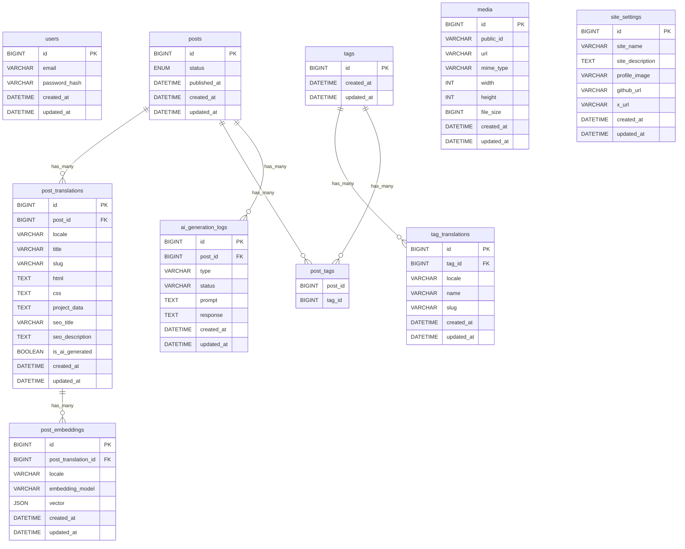

# ER Diagram



## Constraints

### post_translations

- UNIQUE(post_id, locale)
- UNIQUE(slug)

### tag_translations

- UNIQUE(tag_id, locale)

### posts.status

- DRAFT
- PUBLISHED
- PRIVATE

### locales

- JA
- EN
- FR

### ai_generation_logs.type

- TRANSLATION
- TAG_GENERATION
- SEO_ANALYSIS
- EMBEDDING_GENERATION

### ai_generation_logs.status

- PENDING
- SUCCESS
- FAILED

```

```
